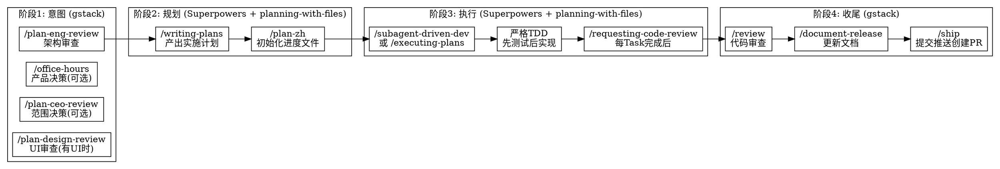

# 开发工作流

## 概述

开发任务通过三个工具协作完成：**gstack**（决策/审查）、**Superpowers**（执行/质量）、**planning-with-files**（状态持久化）。三者按阶段分工，不可跳步。

**关键规则**: 每个阶段必须通过 Skill 工具实际调用对应技能，内部思考不算完成阶段。你说"我先分析一下"然后直接写代码 = 跳过了阶段1。

## 何时使用

**触发条件：**
- 新功能实现、重构、跨文件修改
- 不确定当前阶段该用哪个工具
- 任务跨多个会话需要进度追踪
- 准备 /clear 前需要保存状态

**不适用：** 单行修复、配置调整、纯文案修改（直接改即可）

## 三工具定位

| 工具 | 职责 | 产出 |
|------|------|------|
| gstack | 决策与审查（意图层 + 收尾层） | plan docs, review reports |
| Superpowers | 执行与质量（执行层） | 代码, 测试, commits |
| planning-with-files | 状态持久化（贯穿全程） | task_plan.md, findings.md, progress.md |

## 阶段流程



## 速查：什么阶段用什么工具

| 你在做什么 | 用哪个工具 | 具体命令 |
|-----------|-----------|---------|
| 开始新功能，不确定方案 | gstack | `/plan-eng-review` |
| 产品范围决策 | gstack | `/office-hours` 或 `/plan-ceo-review` |
| 有 UI 改动 | gstack | `/plan-design-review` |
| 写实施计划 | Superpowers | `/writing-plans` |
| 初始化进度文件 | planning-with-files | `/plan-zh` |
| 写代码 | Superpowers | `/subagent-driven-dev` 或 `/executing-plans` |
| 每完成一个 task | Superpowers | `/requesting-code-review` |
| 全部完成，审查 | gstack | `/review` |
| 更新文档 | gstack | `/document-release` |
| 提交推送 | gstack | `/ship` |
| 遇到 bug | 视情况 | 任务内→Superpowers `/systematic-debugging`；跨模块→gstack `/investigate` + `/freeze` |

## 测试隔离规则

技能测试或子代理实验**禁止在主工作区执行**，必须用 git worktree 隔离：

```bash
git worktree add /tmp/task-test -b test/task-name   # 创建隔离区
# 子代理在 /tmp/task-test 里操作
git worktree remove /tmp/task-test --force            # 完成后清理
git branch -D test/task-name                          # 删除测试分支
```

## 持久化规则（强制）

| 时机 | 操作 |
|------|------|
| 会话开始 | 检查 task_plan.md 是否存在，读取当前进度 |
| 每完成一个 Task | 更新 task_plan.md（打勾）+ progress.md（记录） |
| 发现关键信息 | 写入 findings.md |
| /clear 之前 | **必须先更新 progress.md** |
| 上下文达 60% | 主动 /clear + 依赖 progress.md 恢复 |

## 调试规则

- 任务内 bug → Superpowers `/systematic-debugging` + 写入 findings.md
- 跨模块 bug → gstack `/investigate` + `/freeze`
- 同一问题失败 3 次 → 写入 findings.md，标记阻塞，**停止并汇报**

## 禁止事项

- ❌ 直接进入 EnterPlanMode（必须先通过 gstack 审查或 Superpowers 规划）
- ❌ 修改代码前不写测试
- ❌ /clear 前不更新 progress.md
- ❌ /investigate 之前修改代码
- ❌ 跳过 /review 直接 /ship
- ❌ 技能测试/子代理实验直接在项目工作区跑（污染未提交代码）

## 常见错误

| 错误 | 后果 | 正确做法 |
|------|------|---------|
| 跳过阶段1直接写代码 | 方案错误、返工 | 新功能必须先 /plan-eng-review |
| 不更新 progress.md | /clear 后丢失进度 | 每次变更后立即更新 |
| 跳过 /review 直接 /ship | 未审查代码上线 | 严格执行阶段4 |
| 用错工具 | 效率低下 | 参考速查表 |
| 编码前不写测试 | 测试后补失去 TDD 意义 | `/test-driven-dev` 强制执行 |
| 内部思考代替工具调用 | 缺少审查、缺少进度文件 | 每个阶段必须实际调用 Skill 工具，不是脑中过一遍 |

## Red Flags — 立即停止检查

- "这个很简单，直接写代码就行" → 非平凡任务仍需规划
- "测试后面再补" → TDD 不允许反转
- "先 /clear 再更新 progress.md" → 必须先更新再 /clear
- "跳过审查直接发布吧" → /review 是强制步骤
- "用 EnterPlanMode 就够了" → 必须先走 gstack/Superpowers 规划流程
- "我内部已经分析了方案，不用再调用 gstack" → 内部思考不是工具调用，必须实际 invoke Skill 工具
